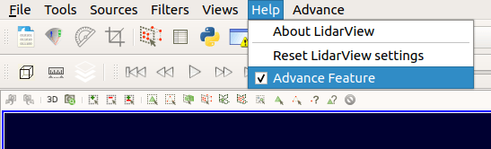
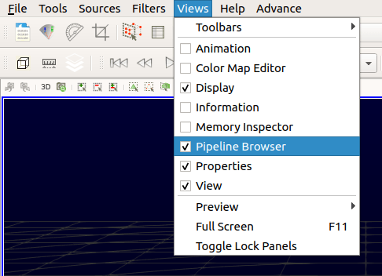
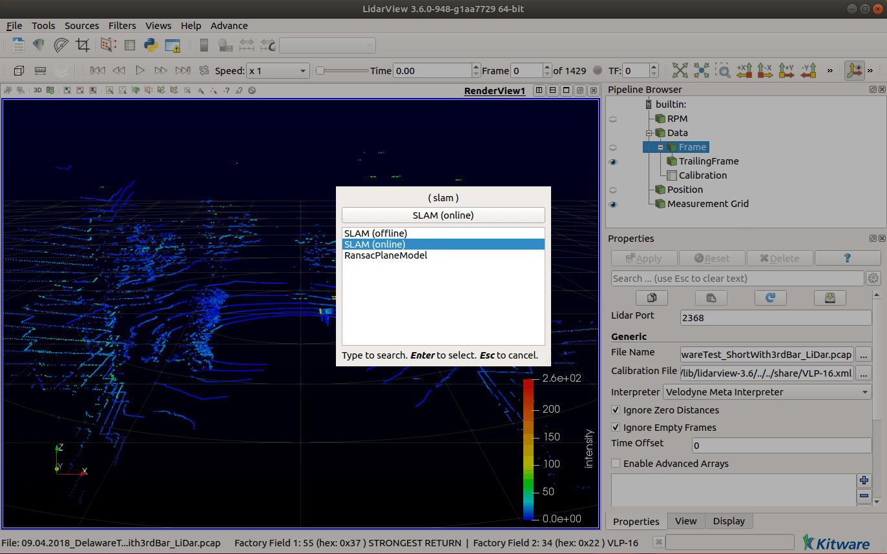
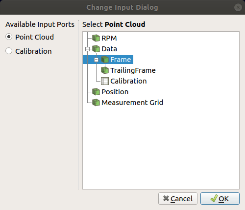
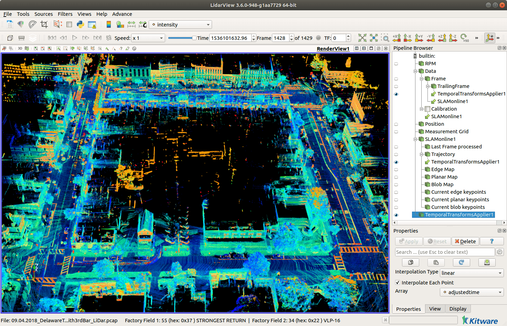

# How to SLAM with LidarView ?

- [Installing LidarView or one of its derivative with SLAM support](#installing-lidarview-or-one-of-its-derivative-with-slam-support)
- [Using SLAM in LidarView](#using-slam-in-lidarview)
- [Saving and exporting SLAM outputs](#saving-and-exporting-slam-outputs)
  - [Saving trajectory](#saving-trajectory)
  - [Saving keypoint maps](#saving-keypoint-maps)
  - [Saving aggregated frames](#saving-aggregated-frames)
    - [Aggregate scans then visualize and export them](#aggregate-scans-then-visualize-and-export-them)
    - [Directly aggregate all points in a LAS file](#directly-aggregate-all-points-in-a-las-file)
- [SLAM parameters tuning](#slam-parameters-tuning)
  - [Environment type](#environment-type)
  - [Mobile platform carrying the LiDAR sensor](#mobile-platform-carrying-the-lidar-sensor)
  - [Increasing the processing speed](#increasing-the-processing-speed)

This document presents some tips on how to use SLAM algorithm in LidarView, or one of its derived distribution. Even if this SLAM is embedded in a Paraview plugin and is therefore directly usable in Paraview, we will focus on its use in LidarView (as we consider here LiDAR data, LidarView  seems a better choice for most use-cases and display).

Since 2020, this SLAM plugin is natively included and available in [LidarView](https://www.paraview.org/lidarview/).

## Installing LidarView or one of its derivative with SLAM support

Pre-built binaries of LidarView with this SLAM plugin are available for download [here](https://drive.google.com/drive/folders/1ouNd3KD2p62a0XqRu4eJ2Tus6LJ-LBE8?usp=sharing).

As these binaries may not always be up-to-date with the latest SLAM release, you may want to compile LidarView with SLAM support from source.
Follow [LidarView's Developer Guide](https://gitlab.kitware.com/LidarView/lidarview-core/-/blob/master/Documentation/LidarView_Developer_Guide.md) instructions to build LidarView on Windows or Linux.

*__IMPORTANT__: to enable SLAM support, ensure  your CMake configuration has these options set to `True` :*
```
-DENABLE_ceres=True
-DENABLE_nanoflann=True
-DENABLE_pcl=True
-DLIDARVIEW_BUILD_SLAM=True 
```

`LidarSlamPlugin` should be automatically loaded at LidarView's startup. If not, ensure **Advanced features** are enabled (in **Help** or  **Tools** > **Debugging**), then select **Advance** > **Tools** > **Manage Plugins** > **Load New**. Browse to your LidarView install directory and select the `libLidarSlamPlugin.so` / `LidarSlamPlugin.dll` (this file can normally be found under `<lv_build>/install/lib/plugins/` on Linux or `<lv_build>/install/bin/plugins/` on Windows).

## Using SLAM in LidarView

LidarView's SLAM has been tested on `.pcap` files aquired from several common LiDAR sensors including:
- Velodyne (VLP-16, VLP-32c, HDL-32, HDL-64, VLS-128)
- Ouster (OS0/1/2-32/64/128)
- Hesai (Pandar128)

Please note that your default LidarView application may not include all the vendors-specific interpreters to decode all these LiDAR sensors data.

1. Open LidarView. Make sure **Advanced Features** are enabled in **Help** tab.

    *__Note__ : In some LidarView applications, this option is available under __Tools__ tab > __Debugging__.*

    

2. Under **Views** tab, enable **Pipeline Browser** and **Properties**. 

    

3. Open a previously recorded `.pcap` file (or set up a stream source) associated with its LiDAR calibration file.

4. In **Pipeline browser**, select **Frame** (the pointcloud source). Then click on **Filters** tab > **Alphabetical** > **SLAM**. Select a SLAM filter: pick **SLAM (online)** to perform a real-time test with live display, or **SLAM (offline)** for a full process, displaying only final trajectory and maps.
   
   *__Tip__ : After having selected __Frame__ , you can also hit `Ctrl+space` and then type `slam` in filter search bar.*

    

5. Depending on the SLAM version being used, a new input dialog may appear:
   - Click on the **Point Cloud** input port, select the **Frame** entry. 
   - Click on the **Calibration** input port, select the **Calibration** entry. 
   - Hit **OK** when done.

    *__Note__: In some SLAM versions, this calibration is optional, and is not asked by this dialog.*
 
    

6. Under **Properties** panel, modify the parameters if needed (see section [SLAM parameters tuning](#slam-parameters-tuning)), then hit **Apply**.
   - If you chose **online SLAM**, a white frame will appear. Hit play button to play back data through the entire recording and watch it SLAM in real time.
   - If you chose **offline SLAM**, nothing new will show up after you hit **Apply**, but that's normal : the computer is working hard to run SLAM on all frames. When the processing is done, it will display its results.

7. You're all done! Now, you can modify the display settings to fit your needs (e.g. color pointclouds using intensity field, modify the points size, hide/show some SLAM outputs, ...).

## Saving and exporting SLAM outputs

Once SLAM has completed, it could be useful to save some results for later use.

### Saving trajectory

You can export the trajectory (for example as a `.csv` or `.poses` file) to avoid running the SLAM again. To save it, select the **Trajectory** output in the **Pipeline Browser** panel, then hit `Ctrl+s` (or **Advance** tab > **File** > **Save Data**), and choose the output format and name in the dialog window.

Later, to load the trajectory back in LidarView, you can drag and drop the `.poses` file in LidarView, or **Advance** tab > **File** > **Open**.

### Saving keypoint maps

Keypoint maps are the local downsampled aggregations of registered keypoints from previous frames. It provides a nice light-weight insight of the reconstructed scene, and helps supervising or interpreting the SLAM behavior and results.

To save SLAM keypoints maps, select the map output you want to save in the **Pipeline Browser** panel, then hit `Ctrl+s` (or **Advance** tab > **File** > **Save Data**), and choose the output format and name in the dialog window. Common pointclouds formats are `csv`, `pcd`, `las`, `ply` or `vtp`.

### Saving aggregated frames

If the visualization of the maps isn't enough for your application, and you need to aggregate all points from all previous frames, this is possible too, but less straightforward.

There are two ways to export aggregated scans:
- The first one allows to aggregate previous LiDAR scans into a single pointcloud that can be visualized in LidarView or Paraview. This pointcloud can be optionally downsampled then saved on disk. As this method aggregates points before saving them, the memory consumption is important and can lead to saturation.
- The second method uses a previously saved trajectory to aggregate successive scans by directly appending data to a LAS file on disk.

#### Aggregate scans then visualize and export them

*__Note__: Be careful, the aggregation of ALL previous points may represent a huge pointcloud! With ~1 000 000 points per second and the associated measurements (intensity, time, laser ID, etc.), each minute of recording represents several GB of data! Depending on your machine specifications, this may not fit into memory and lead to an annoying crash of the application.*

To visualize all frames as a single aggregated pointcloud, you need to instanciate several filters to aggregate all scans using the computed trajectory (sensor path estimated by SLAM):

1. Select the **Trailing frame** entry and set the desired number of trailing frames (0 meaning only the last frame, and, for example, 10 displaying the current frame and the 10 previous ones). Be careful, a big number of trailing frames may lead to important processing duration and memory consumption. Click on **Apply**. You should now see all the frames aggregated in a non-sense way (all points being displayed using their coordinates relative to the sensor at the time of acquisition).

2. Instantiate a **Temporal Transform Applier** filter using the **Trailing Frame** as point cloud entry, and the output SLAM **Trajectory** for trajectory entry. Depending on the number of trailing frames, the transformation and aggregation of pointclouds may be long. When it succeeds, you should now see all points being correctly registered. If the colors look strange, check that you are displaying the `intensity` array in the main toolbar.



These first steps allow you to visualize all the aggregated points in LidarView. If you want to optionally downsample this point cloud and save it on disk, please follow these additional steps:

3. Instantiate a **Merge Blocks** filter on the output of the **Temporal Transform Applier**.

   If you want to subsample the aggregated pointcloud by merging close points, make sure that the advanced properties of the filter are enabled by toggling the little gear wheel in the **Properties** panel. You can then specify the *Tolerance* and *Tolerance Is Absolute* parameters. For example, to aggregate all points but keeping only a single point per 5 cm cube, set *Tolerance* to 0.05 and enable *Tolerance Is Absolute*.

   Click on **Apply**. The process can take some seconds. When it has finished, all points are now merged into a single (optionally downsampled) pointcloud.

4. Instantiate an **Extract Surface** filter on the ouput of the **Merge Blocks**. This will convert the underlying structure of the pointcloud, allowing more available filters or file types for storage.

5. As usual, save aggregated frames by selecting the desired output **Extract Surface**, hit `Ctrl+s`, and choose the output format (CSV, PLY, VTP) and name.

#### Directly aggregate all points in a LAS file

This method directly appends points to a LAS file on disk, which has the advantage to avoid saturating the RAM.

1. [Save the SLAM trajectory](#saving-trajectory) on disk as a `.poses` CSV file.

2. Open a new LidarView session, then load your pcap recording.
   Load the previously exported SLAM trajectory using **Advance** > **File** > **Open**.

3. Instantiate a **Temporal Transform Applier** filter using the **Frame** as point cloud entry, and the output SLAM **Trajectory** for trajectory entry.

4. Save the output of the **Temporal Transform Applier** by hitting `Ctrl+s`, selecting the **LAS point cloud file** format, and specifying the output file name before validating. A new dialog will appear to configure the LAS file writer, where you can modify the parameters to your needs. For example, if you want to aggregate points from frame 100 to 500, but using only points from 1 frame out of 3, specify *First Frame = 100*, *Last Frame = 500*, *Frame Stride = 3*.
The export can be quite long (from a few seconds to several minutes) as each specified frame needs to be processed.

## SLAM parameters tuning

The default SLAM parameters should be a good compromise to run the SLAM for most outdoor urban environments with the LiDAR sensor mounted on top of a vehicle.
However, the parameters should be adapted to your specific needs or environment to have an optimal result.

*__Note__: To see all parameters, make sure that the advanced properties of the SLAM filter are enabled by toggling the little gear wheel in the **Properties** panel.*

Here are some hints to help you tune some of the main parameters. These are some typical parameters preset to consider depending on your dataset characteristics.

### Environment type

The type of environment influences a lot the number and quality of extracted keypoints. A feature-poor scene will need more and denser keypoints to give nice results. However, we want to keep this number of keypoints as small as possible to reduce memory consumption and problem dimensionality.

- ***Outdoor scene***
  + **Keyframe distance/angle threshold**: 0.5-1 m distance, 2-5° angle.
  + **Edges/Planes map resolution**: 30 cm for edges, 60 cm for planes.
- ***Indoor scene***
  + **Keyframe distance/angle threshold**: 0.1-0.5 m distance, 5° angle.
  + **Minimum distance to sensor**: 0.5 m
  + **Edges/Planes map resolution**: 20 cm for edges, 30 cm for planes
  + **Rolling grid resolution**: 3 m.
- ***Poor geometric scene or scene with some strong invariance***: corridor, fields, highway, forest...
  + **Keyframe distance/angle threshold**: 0 m distance, 0° angle (disabled).
  + **Use Blobs**: enabled
  + **ICP-Optimization iterations**: 4
  + **Edges/Planes map resolution**: 20 cm for edges, 30 cm for planes

### Mobile platform carrying the LiDAR sensor

The type of the mobile platform has a great impact on the motion model, or in other words, how we estimate and compensate the motion since the previous scan. Smooth motions will be much easier and lead to more stable results (as it provides continuous and approximately constant speed motion hypothesis to interpolate new pose), whereas high-frequency motions or fast moving platforms will be less robust.

- ***Vehicle***: LiDAR sensor mounted on top of a car
  + **Ego-Motion mode**: Motion extrapolation
  + **Undistortion mode**: Once / Refined
- ***Drone***: LiDAR sensor carried by a drone
  + **Ego-Motion mode**: Motion extrapolation / Registration on previous frame
  + **Undistortion mode**: Refined
- ***Pedestrian***: man-held LiDAR sensor
  + **Ego-Motion mode**: Motion extrapolation / Registration on previous frame / Disabled
  + **Undistortion mode**: Disabled / Refined

### Increasing the processing speed

To increase the processing speed, consider also tweaking these parameters:

- **Number of threads**: Maximum number of threads used for parallel processing. Allowing several threads (about 4) increases SLAM processing speed, skipping less frames, and thus improving result.

- **Keypoints maps update step**: If you don't need the map display to be refreshed at each new frame, you should consider increasing this value. Setting it to 10 will only update maps every 10th frame (1 second at 600 rpm), which is far enough for a nice visualization. This will save some output conversion time.

- **LidarView play speed**: This is not specific to the SLAM filter, but LidarView is controlling the playback speed of the LiDAR recording. It can be set from the VCR toolbar. For example, *Speed = x1* will play at real speed, *Speed = x3* will play 3 times faster. If the SLAM algorithm isn't fast enough to process all incoming frames, it will drop some of them. If your LiDAR is slowly moving or with smooth motion, this not a problem. However, if it skips too many frames compared to the LiDAR motion, consider choosing the *Speed = All Frames*, which will play as fast as possible but ensuring that all frames are processed.
